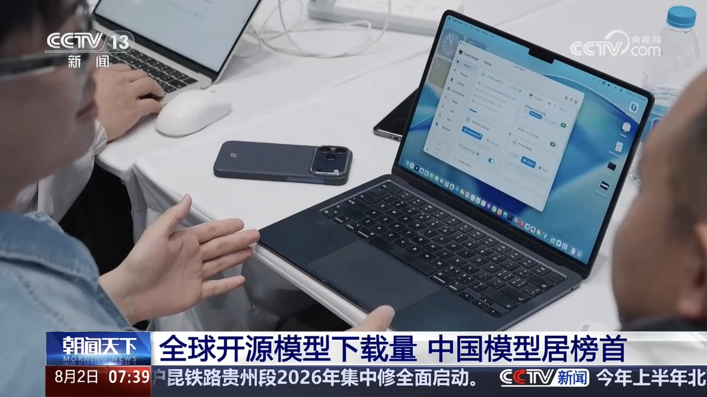
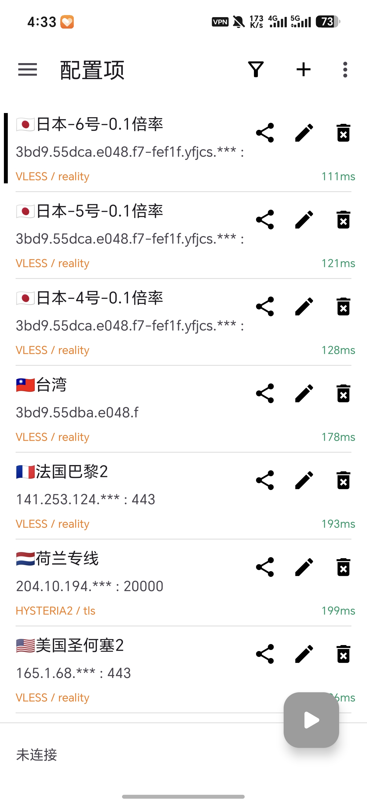
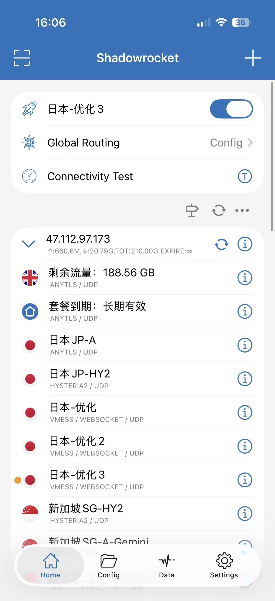
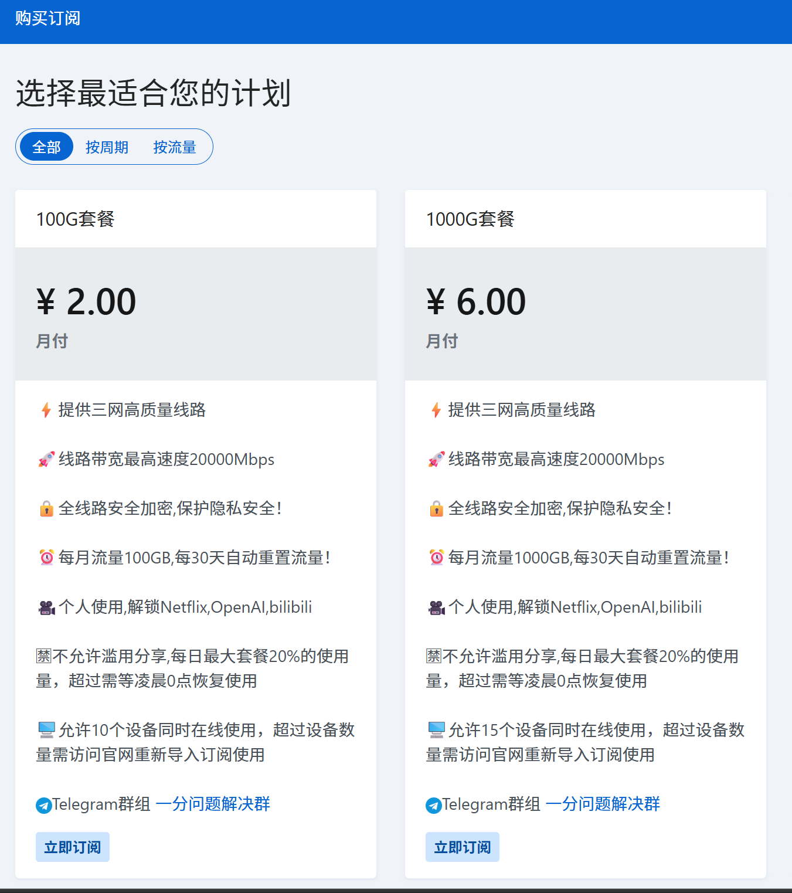
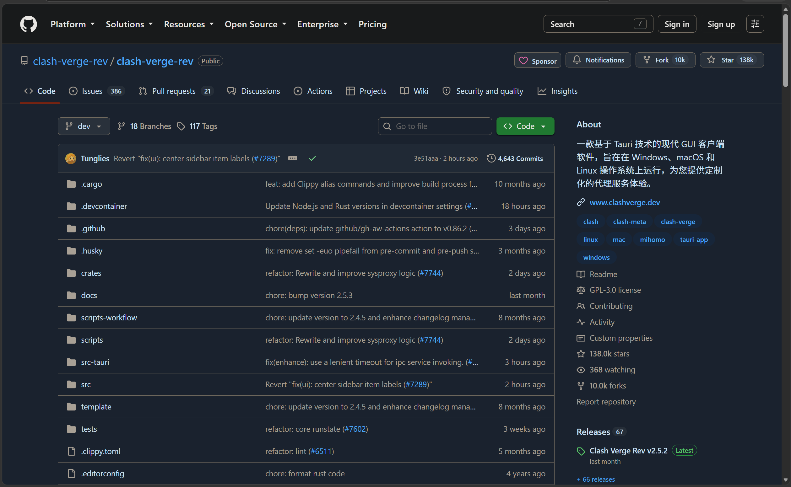
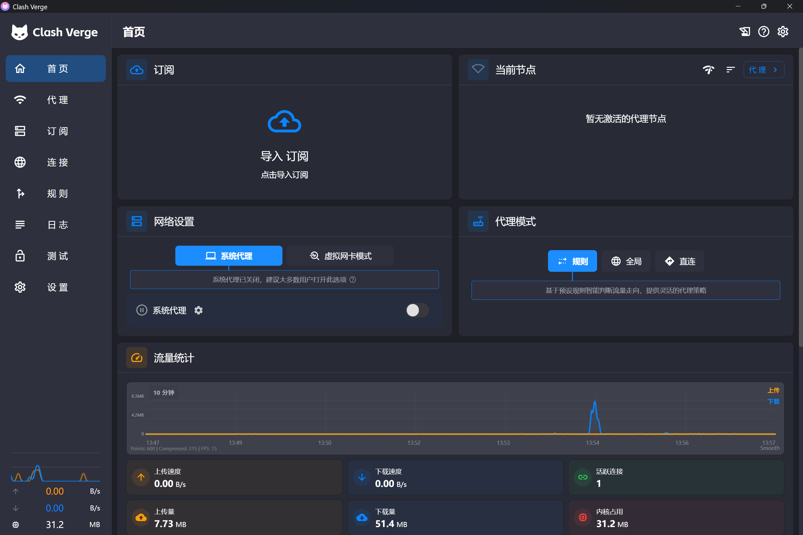
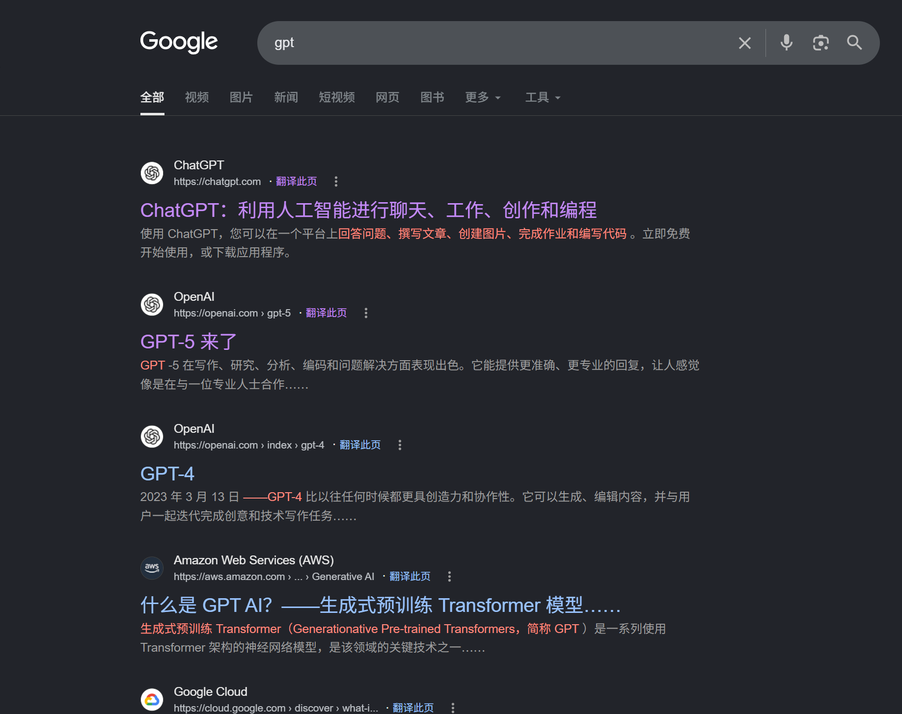
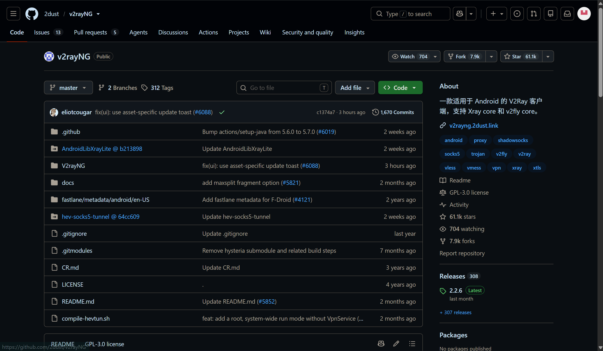
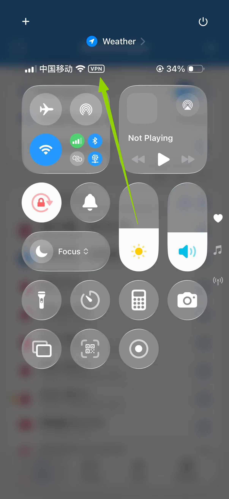

# 科学上网完全指南

> 一份写给零基础小白的开放教程：教你用开源客户端搭配机场，5 分钟跑通第一次，常见问题逐个排查。
> 
> 

**这是一份开放文档**，任何人都可以阅读、转发、反馈。如果你照着做遇到了问题，或者发现哪里过时了，欢迎在评论区留言，我们会持续更新。

---

## 目录

- 01 为什么需要科学上网

- 02 基础概念

- 03 客户端选择

- 04 机场推荐

- 05 Windows 操作（Clash Verge Rev）

- 06 手机配置

- 07 聚合 App 与机场的差异

- 08 常见问题

- 09 安全与免责

---

## 01 为什么需要科学上网


很多人第一次听到"科学上网"这个词，他也有别称“魔法”，”梯子“等，最直白的就是”翻墙“，听到这些，大家可能第一反应是"是不是要做什么见不得人的事"。其实不是。它解决的是一个很朴素的问题：**有些网站和服务，你在国内正常打不开，或者打开很慢**。

这一章不讲技术，只讲清楚三件事：哪些场景真的需要它、它能带来什么、以及你需要知道的风险。

---

### 哪些场景真的需要

**获取学习资源。** 很多优质的技术文档、开源项目、编程问答社区、大学公开课，服务器在海外。你在国内访问时，要么打不开，要么加载到一半就超时。对于程序员、学生、研究者来说，这是最现实的需求。

**使用海外服务。** 有些工具和服务在国内没有运营，或者访问不稳定。比如部分国际开发工具、云服务控制台、海外社交平台。你需要它们来完成工作或保持联系。

**保护隐私。** 在公共 Wi\-Fi（咖啡馆、机场、酒店）上网时，你的流量是明文传输的，理论上可以被同一网络里的人截获。加密连接能让你的数据不被轻易窥探。

**绕过地域限制。** 有些内容服务只对特定地区开放，你在其他地区访问会被拒绝。科学上网能让你访问到这些内容。

---

### 它能带来什么

- 访问更完整的信息世界，减少"信息差"

- 稳定的海外服务体验，不再频繁超时

- 公共网络下的加密保护，降低被窃听的风险

---

### 你需要知道的风险

**法律风险。** 不同地区对网络访问工具的规定不同。使用前请了解并遵守你所在地区的法律法规，这是你自己的责任。

**安全风险。** 市场上服务商良莠不齐。选择可信的服务商很重要，避免使用来路不明的免费工具——它们可能窃取你的账号密码或浏览记录。

**稳定性风险。** 这类服务可能随时失效或更换地址，这也是这份文档需要持续更新的原因

---

### 小结

科学上网不是"做什么坏事"，而是一种**获取信息、保护隐私的技术手段**。它有用，但也有风险。理解了"为什么需要"，下一步我们来看它到底是怎么工作的——见 02 基础概念。

---

## 02 基础概念


这一章用最通俗的方式，讲清楚科学上网涉及的核心概念。你不需要记住所有名词，只需要理解"它大概是什么、为什么需要它"。看完这一章，后面配置时你就不会一头雾水

---

### 为什么有的网站打不开

先理解一个基本事实：**互联网并不是一个完全连通的网络**。你访问一个网站，数据要经过很多中间节点。在某些地区，一部分海外网站的访问会被限制或干扰，结果就是：

- 网站直接打不开，显示"无法访问此网站"

- 能打开但极慢，图片加载不出来

- 时好时坏，刷新几次偶尔成功

这不是你的电脑坏了，也不是网站坏了，而是**访问路径被干扰了**。

---

### 什么是"墙"   

"墙"是防火长城（GFW）的俗称，是部署在国际网络出口上的一套审查与封锁系统。它会对进出境的网络流量做检测：目标网站被列入封锁名单，就直接丢弃你的请求，让你打不开；它还能识别翻墙协议并主动干扰。所以"科学上网"的本质，就是通过加密和伪装，让墙看不懂你在访问什么，从而绕过封锁。 

---

### 什么是"代理"

代理（Proxy）可以理解成一个**中间人**。正常情况下，你的设备直接连目标网站；使用代理后，你的设备先连到代理服务器，由它帮你访问目标网站，再把结果传回给你。

```Plain Text
你的设备 ──→ 代理服务器 ──→ 目标网站
                ↑
             数据在这里中转
```

这样做的好处是：目标网站看到的是代理服务器的访问，而不是你的；同时，你和代理服务器之间的连接是加密的，干扰者看不到你真正在访问什么。

---

### 什么是"加密"

加密就是把你的数据变成别人看不懂的乱码，只有持有密钥的一方才能还原。科学上网工具会在你的设备和服务器之间建立一条**加密通道**，就像一条密封的管道：

- 管道外的干扰者看不到管道里传输的内容

- 即使看到，也只是乱码，无法还原

这就是为什么它能"绕过"干扰——不是把干扰消灭了，而是让干扰者**看不懂**你在传什么。

---

### 什么是"节点"

节点（Node）就是代理服务器的具体地址，通常包含服务器位置和端口。你可以把节点理解成"通往目标网站的一条隧道入口"。

- 一个服务商通常提供多个节点，分布在不同地区

- 不同节点速度、稳定性不同，可以切换

- 节点信息可能变化，失效时需要更新

---

### 什么是"机场"和"订阅"

机场是提供代理服务的平台，你付钱购买后，它会给你一个**订阅链接**。把这个链接复制到客户端里，客户端会自动拉取所有节点的配置信息，省去手动一个个填写的麻烦。

```Plain Text
机场（服务商）→ 提供订阅链接 → 导入客户端 → 自动获取节点列表 → 选择节点连接
```

用机场的好处是：节点失效了，机场更新后你重新更新订阅就行，不用手动改配置。

---

### 什么是"客户端"

客户端是你设备上安装的软件，负责三件事

1. 管理节点信息（导入订阅 / 手动添加）

2. 建立加密连接（连接节点）

3. 管理流量规则（哪些走代理、哪些直连）

不同客户端支持的协议和功能不同，下一章会详细对比推荐。

---

### 什么是"聚合 App"

市面上有一些 app 内置了节点和线路，打开就能用，不需要自己买机场、配置客户端。比如快连 VPN、老王 VPN 等。

这类聚合 app 和"机场 \+ 开源客户端"方案的区别，在第 07 章会详细对比。

---

### 常见术语速查

|术语|一句话解释|
|---|---|
|代理|帮你中转访问的中间服务器|
|加密|把数据变成乱码，保护传输内容|
|节点|代理服务器的具体地址，一条"隧道入口"|
|客户端|你设备上安装的软件，负责建立加密连接|
|订阅|机场提供的节点列表链接，客户端可自动更新|
|机场|提供代理服务的平台，给你订阅链接|
|聚合 app|内置节点、一键连接的 app，如快连 VPN|
|协议|客户端和服务器之间通信的规则，如 Shadowsocks、VMess、Trojan|

> 你不需要理解协议的细节。只要知道：**客户端 \+ 订阅链接 = 能上网**。
> 
> 

---

### 小结

一句话总结这一章：**科学上网 = 你从机场买订阅 → 把链接导入客户端 → 客户端通过加密通道连到代理节点 → 正常访问目标网站。** 理解了这一点，接下来我们看看该选哪个客户端——见 03 客户端选择。

---

## 03 客户端选择


这一章帮你搞清楚：市面上有哪些客户端、各自有什么差异、你应该用哪个。核心结论先放前面：**Windows 用 Clash Verge Rev或者v2rayN，安卓用 v2rayNG，iPhone 用 sing\-box 或 Shadowrocket**。下面解释为什么。

---

### 客户端分类

**Clash 系**：基于 Clash 内核，支持订阅导入、规则分流、多节点切换，功能强大，适合搭配机场使用。代表：Clash Verge Rev、FlClash、Clash for Windows（已停更）。

**v2ray 系**：基于 v2ray / Xray 内核，同样支持订阅导入，界面更简洁。代表：v2rayNG（安卓）、v2rayN（Windows）。

> 还有很多类型，这就不赘述了。无论哪一类，搭配机场订阅都能用。差异主要在界面、功能和内核协议支持上。
> 
> 

---

### 各客户端对比

|客户端|平台|开源|特点|推荐度|
|---|---|---|---|---|
|Clash Verge Rev|Windows / macOS|是|界面现代、功能全、活跃维护，当前 Clash 系首选|★★★★★|
|FlClash|Windows / macOS / 安卓 / iOS|是|跨平台，界面简洁，新手友好|★★★★|
|v2rayNG|安卓|是|安卓端最流行，稳定轻量|★★★★★|
|v2rayN|Windows|是|Windows 端 v2ray 系经典，功能全|★★★★|
|Stash|iOS|否|付费，Clash 系，iOS 体验好|★★★★|
|Shadowrocket|iOS|否|付费，iOS 经典，支持协议多 |★★★★|
|Clash for Windows|Windows|是|已停止维护，不推荐新用户使用|★|

> 说明：Clash for Windows 已停止维护，虽然还能用，但不再更新，新用户不建议选择。
> 
> 

---

### 怎么选

**Windows 用户**：首选 Clash Verge Rev。界面现代、功能完整、持续维护，导入机场订阅后开箱即用。操作步骤见 05 Windows 操作。央视严选，哈哈哈。



**安卓用户**：首选 v2rayNG。安卓端最流行、最稳定，界面简洁，导入订阅即可。操作步骤见 06 手机配置。



**iPhone 用户**：iOS 没有免费的开源 Clash 客户端，主流是付费的 Stash 或 Shadowrocket。两者都支持机场订阅，Stash 更贴近 Clash 体验，Shadowrocket 协议支持更广，是较为主流的iOS科学上网软件，shadowrocket下载需要美区ID且需要付费，较为复杂，有需要的不愿意麻烦自己注册的可以联系作者获取\#



**多设备用户**：FlClash 跨平台，一个客户端覆盖 Windows / macOS / 安卓 / iOS，适合想统一体验的人。

---

### 各个客户端下载地址：

[https://xiazai.yfjc.win/1/]()

这是大部分机场都会带的一些教程指南，这个里面下载各个平台的客户端，注意本机场无法国内访问，需翻墙，但是这个下载地址不知道有没有限制，测试可以国内直连，情况可能会有变化，请另寻他法

---

### 客户端差异速查

- **界面**：Clash Verge Rev 和 FlClash 更现代，v2rayNG 更简洁

- **规则分流**：Clash 系支持规则分流（国内直连、国外走代理），v2ray 系也支持但配置方式不同

- **协议支持**：不同客户端支持的协议不同，主流机场订阅一般都能兼容

- **维护状态**：优先选活跃维护的客户端，避免用停更软件

---

### 小结

选客户端不用纠结，**按你的设备选主流推荐即可**：Windows 用 Clash Verge Rev，安卓用 v2rayNG，iPhone 用 Stash 或 Shadowrocket。选好客户端后，下一步是选机场——见 04 机场推荐。

---

## 04 机场推荐


选好客户端后，下一步是选机场。这一章先讲清楚"怎么判断一个机场靠不靠谱"，再给出推荐清单。**推荐清单会持续更新**，因为机场的稳定性和口碑会变化。

---

### 怎么判断一个机场靠不靠谱

**看运营时长。** 运营时间长的机场通常更稳定。刚开几个月就跑路的机场不在少数，优先选运营一年以上的。

**看节点数量和线路质量。** 节点多不等于好，关键是线路质量。香港、新加坡、日本、美国这些常用地区要有稳定节点，看是否有专线（IEPL/IPLC）和原生 IP。

**看速度测试和口碑。** 靠谱的机场通常有测速页面或第三方测速记录。也可以去相关社区搜搜口碑，看看有没有大面积翻车记录。

**看客服响应。** 出问题能不能及时解决很重要。有工单系统、Telegram 群、响应快的机场更值得选。

**看套餐和价格。** 价格太低的要警惕（可能跑路或超售），价格太高也没必要。先买月付或小流量套餐试用，确认稳定再买长期。

**看隐私政策。** 正规机场会说明是否记录日志。优先选"无日志"政策的。

---

### 推荐清单

> 以下为当前推荐，会随运营情况更新。**标注【推广】的为作者推荐，可放心试用。**
> 
> 

|机场|特点|适合人群|备注|
|---|---|---|---|
|一分机场：https://xn\-\-4gqx1hgtfdmt\.com/\#/register?code=H1NYycCi|老牌机场，自用三年多，价格便宜，可以买断流量，不限时间，在市面上属于是少有的套餐模型|学生，偶尔使用|本机场需要翻墙访问|
|魔戒机场：<br>https://47\.242\.128\.61:8000/register?aff=H0yhxAKy<br>|老牌机场，相同运营商还有八戒机场。此机场套餐只有一次性类的，八戒则是按月付费套餐类型|需求量大，留作备用|国内直连。导航站：<br>https://129\.226\.120\.177:8000/<br>|
|蓝海加速：https://app\.lanhai\.in:7779/\#/register?code=brnPPIXz|这个机场也是自用时间比较久的 节点稳定 流量质量较高 不用翻墙就可以打开 缺点是价格稍贵|预算较充足，追求简单稳定人群|本机场无需翻墙访问，国内直连|



---

### 怎么购买和获取订阅链接

1. 打开机场官网，注册账号

2. 选择套餐并支付

3. 在"我的订阅"或"用户中心"找到订阅链接

4. 复制订阅链接，导入客户端（见 05 Windows 操作 或 06 手机配置）

---

### 购买建议

- **先试用**：先买月付或最便宜的套餐，确认速度、稳定性、客服都满意再买长期

- **避免一次性买太久**：机场可能跑路，不建议一次买一年以上

- **保留订阅链接**：订阅链接通常绑定账号，换设备时重新导入即可

- **注意流量**：不同套餐流量额度不同，看视频流量消耗快，注意套餐流量是否够用

---

### 小结

选机场的核心是**看运营时长、线路质量、口碑、客服**。先试用再长期购买，避免踩坑。选好机场后，下一步就是动手配置了——见 05 Windows 操作。

---

## 05 Windows 操作（Clash Verge Rev）


本章以 **Clash Verge Rev** 为例，从下载到连接，手把手带你跑通。请按顺序操作，不要跳步。

> 如果你用其他客户端，步骤大同小异：下载 → 导入订阅 → 选节点 → 连接。具体差异见 03 客户端选择。
> 
> 

---

### 第一步：下载 Clash Verge Rev

1. 打开浏览器，进入 Clash Verge Rev 的 GitHub 发布页：



中文站应该是这个：

[https://clashrev.com.cn/index.html]()

2. 找到最新的 Windows 版本（文件名通常含 `x64` 或 `x86`），GitHub点击上图右下角releases哪里的Clash Verge Rev v2\.5\.2，跳转到新页面找对应文件包，macOS同理

3. 点击下载 `.exe` 安装包

> 如果 GitHub 打不开，可以在国内镜像站或机场提供的下载页下载，见 08 常见问题 的"下载页面打不开"。
> 
> 

---

### 第二步：安装

1. 找到下载好的安装包（通常在"下载"文件夹）

2. 双击运行，如果弹出安全提示，选择"仍要运行"或"更多信息 → 仍要运行"，一般不会跳出安全警告

3. 按提示点击"下一步"直到安装完成

> 安装时如果杀毒软件报警，先确认安装包来源可信，再决定是否放行。来源不明的安装包不要强行安装。
> 
> 

---

### 第三步：导入机场订阅

安装完成后打开 Clash Verge Rev，导入你从机场购买的订阅链接：



1. 点击左侧"订阅"（Profiles）标签

2. 在输入框中粘贴机场提供的订阅链接

3. 点击"导入"（Import），订阅会自动下载并出现在列表中

> 订阅链接在机场官网的"用户中心"或"我的订阅"里，见 04 机场推荐。
> 
> 

---

### 第四步：选择节点并连接

1. 点击左侧"代理"（Proxies）标签


2. 在节点列表中选择一个节点（建议先选香港或离你近的节点）

3. 点击首页"开启系统代理"开关

---

### 第五步：验证是否成

1. 打开浏览器，访问一个之前打不开的网站，以谷歌搜索gpt为例

2. 能正常打开即成功



---

### 第六步：开机自启与规则模式（可选）

- **开机自启**：设置 → 常规 → 开启"开机自启"，以后不用手动打开

- **规则模式**：Clash Verge Rev 默认使用规则分流（国内直连、国外走代理），一般不用改。如果想让所有流量都走代理，可以切换到"全局模式"

---

### 常见问题速查

- 连接成功但网页打不开 → 见 08 常见问题 的"连接成功但无法上网"

- 速度很慢 → 切换其他节点，或见 08 常见问题 的"速度很慢"

- 订阅导入失败 → 检查订阅链接是否完整、是否过期

配置完成，去 06 手机配置 看看手机怎么配，或阅读 07 聚合app与机场差异 了解不同方案的区别。

---

## 06 手机配置


本章分安卓和 iPhone 两部分。核心和电脑一样：**装客户端、导入订阅、选节点、连接**。

---

### 安卓手机（v2rayNG）

#### 第一步：安装 v2rayNG

1. 打开浏览器，进入 v2rayNG 的 GitHub 发布页，也可进入第三章各个客户端下载地址里找



2. 下载最新的 APK 文件，依旧是点击右下角releases，进去找对应版本，不知道哪个版本问豆包

3. 点击安装，如果提示"未知来源"，在设置中允许安装

#### 第二步：导入机场订阅

1. 打开 v2rayNG

2. 点击右上角"\+"号，选择"从剪贴板导入订阅"或"添加订阅"

3. 粘贴机场提供的订阅链接

4. 点击右上角"三个点"图标，更新订阅

#### 第三步：连接

1. 在节点列表中选择一个节点

2. 点击右下角"V"图标，或点击节点进入连接

3. 首次连接时，系统会提示"允许创建 VPN 连接"，选择允许

> 首次连接时系统提示"允许创建 VPN 连接"，选择允许。这是客户端建立加密通道的正常请求。
> 
> 

---

### iPhone（iOS）

#### 第一步：安装客户端

iOS 没有免费的开源 Clash 客户端，主流是付费的 Stash 或 Shadowrocket：

1. 打开 App Store

2. 搜索 Stash 或 Shadowrocket

3. 点击购买并下载安装


> 如果 App Store 里搜不到，可能是地区限制，参考 08 常见问题 的"App Store 搜不到客户端"。
> 
> 

#### 第二步：导入机场订阅

1. 打开客户端

2. 找到"订阅"或"配置"入口

3. 粘贴机场提供的订阅链接，导入

4. 更新订阅，获取节点列表


#### 第三步：连接

1. 选择一个节点

2. 点击"连接"

3. 首次连接时，系统会提示"允许 VPN 配置"，选择"允许"并验证




---

### 手机端常见问题速查

- 连接成功但无法上网 → 见 08 常见问题

- 安卓提示"未知来源" → 按本章安卓第一步处理

- iPhone 提示"VPN 配置" → 选择允许即可

配置完成，去 07 聚合app与机场差异 了解不同方案的区别，或阅读 08 常见问题。

---

## 07 聚合 App 与机场的差异


市面上除了"机场 \+ 开源客户端"方案，还有一种更省事的方案：**聚合 App**。这类 app 内置了节点和线路，打开就能用，不需要自己买机场、配置客户端。典型代表有快连 VPN、老王 VPN （据说是网警钓鱼的）等。还有如今各家机场本身也会做聚合app，但是底座都是开源的那些客户端进行魔改。


这一章帮你搞清楚这两种方案的区别，以及该怎么选。

---

### 两种方案对比

|对比项|机场 \+ 开源客户端|聚合 App（如快连 VPN）|
|---|---|---|
|使用门槛|需要装客户端、导入订阅|下载 app 直接用|
|节点选择|自己选节点、可切换|自动选择，一般不可自定义|
|价格|通常按流量/套餐，较便宜|通常按订阅（月/年），较贵|
|灵活性|高，可自定义规则、多设备|低，功能固定|
|设备支持|客户端覆盖各平台|以手机为主，部分有电脑版|
|隐私|取决于机场，可选无日志|节点由 app 方统一管理，透明度较低|
|稳定性|取决于机场线路|取决于 app 方运营|

---

### 聚合 App 的优势


- **零门槛**：下载安装就能用，不需要理解任何概念

- **上手快**：适合完全不想折腾、只想快速上网的人

- **多平台**：手机、电脑都有，一个账号通用

---

### 聚合 App 的劣势

- **价格偏高**：同样的流量，聚合 app 通常比机场贵

- **灵活性差**：不能自定义节点、规则，遇到线路拥堵只能等

- **隐私风险**：节点由 app 方统一管理，你无法确认数据去向，透明度低

- **稳定性风险**：这类 app 容易被封禁下架，可能随时失效

---

### 机场 \+ 开源客户端的优势

- **性价比高**：同样的预算，机场通常能买到更多流量

- **灵活可控**：自己选节点、切换线路、配置规则

- **透明度高**：客户端开源，机场可查口碑和隐私政策

- **多设备统一**：一个订阅，电脑、手机都能用

---

### 机场 \+ 开源客户端的劣势

- **有学习成本**：需要理解客户端、订阅、节点等概念

- **需要自己维护**：节点失效要更新订阅，出问题要自己排查

---

### 怎么选

- **想省事、不在乎价格** → 用聚合 App，下载即用

- **想省钱、愿意花几分钟配置** → 用机场 \+ 开源客户端，性价比更高

- **多设备、长期使用** → 推荐机场 \+ 开源客户端，一个订阅全设备通用

---

### 小结

两种方案没有绝对的好坏，核心是**省事 vs 省钱**的取舍。聚合 App 适合不想折腾的人，机场 \+ 开源客户端适合追求性价比和灵活性的人。如果你已经看到这里，说明你愿意花几分钟配置——那机场 \+ 开源客户端就是更适合你的方案。

---

## 08 常见问题


这一章按"遇到什么问题 → 怎么排查"来组织。如果你照着做了但没成功，先在这里找答案。找不到就按 09 安全与免责 里的方式联系我们反馈。

---

### 连接成功但无法上网

这是最常见的问题。连接显示成功，但网页打不开，按顺序排查：

1. **确认系统代理已开启**：Clash Verge Rev 需要开启"系统代理"开关，v2rayNG 需要开启 VPN 连接。如果没开，流量不会走代理

2. **切换节点**：当前节点可能已失效或拥堵，换一个节点试试

3. **检查订阅是否过期**：机场订阅通常有有效期，过期后节点全部失效，重新更新订阅

4. **重启客户端**：偶尔客户端状态异常，重启能解决大部分问题

---

### 速度很慢

1. **切换节点**：优先选择离你近的节点（如香港、新加坡），延迟通常更低

2. **避开高峰时段**：晚高峰（20:00\-23:00）普遍较慢

3. **检查本地网络**：先断开代理，测一下直连速度，排除本地网络问题

4. **更换协议**：不同协议速度不同，可以尝试切换

---

### 下载页面打不开

如果你连客户端都下载不了，说明访问路径本身有问题。尝试：

1. **换一个下载源**：GitHub 打不开时，用国内镜像站或机场提供的下载页

2. **用手机流量下载**：部分情况下，手机流量和宽带走不同的访问路径

3. **请朋友帮忙**：让已经能访问的朋友下载后传给你

---

### App Store 搜不到客户端

1. **检查地区**：部分客户端只在特定地区的 App Store 上架

2. **切换 Apple ID 地区**：在设置中切换地区后重新搜索

3. **使用机场提供的安装方式**：部分机场提供 TestFlight 或企业签名版

---

### 连接频繁断开

1. **检查网络稳定性**：Wi\-Fi 信号弱会导致连接中断

2. **切换节点**：当前节点可能不稳定

3. **关闭省电模式**：部分手机的省电模式会杀掉后台进程，导致连接断开

4. **更新客户端**：旧版本可能存在连接问题

---

### 提示"证书错误"或"无法验证"


1. **确认客户端来源可信**：来路不明的客户端可能携带风险

2. **更新系统时间**：系统时间不准会导致证书验证失败

3. **更新客户端**：旧版本可能与新协议不兼容

---

### 部分应用不走代理

1. **检查分流规则**：Clash 系客户端默认规则分流（国内直连、国外走代理），部分应用可能被规则排除，可切换到"全局模式"测试

2. **确认系统代理已开启**：部分应用只认系统代理

3. **查看客户端日志**：确认该应用的流量是否走了代理

---

### 还是不行？

如果以上方法都试过仍无法解决，请按以下格式反馈，能帮我们快速定位

- 设备型号与系统版本

- 客户端名称与版本

- 具体操作步骤

- 报错信息或截图

反馈方式见 09 安全与免责。

---

## 09 安全与免责


这一章讲两件事：怎么安全地使用这类工具，以及这份文档的法律边界。建议所有读者都读完。

---

### 如何选择可信的服务商

市场上服务商良莠不齐，选择时注意以下几点：

- **优先选择口碑好、运营时间长的服务商**，避免来路不明的"免费"服务

- **警惕免费工具**：免费往往意味着你的数据被拿去变现，可能窃取账号密码或浏览记录

- **查看隐私政策**：正规服务商会说明数据如何处理、是否记录日志

- **避免使用来源不明的安装包**：可能捆绑恶意软件

> 一个简单的判断标准：如果一项服务"免费"得让你怀疑，那它很可能在别处收费——通常是你的数据。
> 
> 

---

### 安全使用建议

- **不要在代理环境下登录重要账号**（如网银、支付），除非你确认连接安全

- **定期更新客户端**，及时修复已知漏洞

- **不要使用同一密码注册多个服务**，防止撞库

- **公共 Wi\-Fi 下务必开启加密连接**

- **不要轻信"加速神器""免费 VPN"类广告**，多数是钓鱼或恶意软件

---

### 数据与隐私

- 你的流量会经过机场或聚合 app 的服务器，**服务商理论上可以看到你的访问记录**

- 选择"无日志"政策（不记录用户访问日志）的服务商，能降低隐私风险

- 聚合 app 的节点由 app 方统一管理，透明度更低，使用前请仔细评估

- 没有任何工具能 100% 保证匿名，重要操作请保持警惕

---

### 免责声明

**本教程仅用于技术学习与信息获取的科普目的。**

1. **法律合规**：不同地区对网络访问工具的规定不同。使用任何网络工具前，请了解并遵守你所在地区的法律法规。因使用本教程内容产生的任何法律后果，由使用者自行承担。

2. **内容时效**：本教程中的工具、节点、步骤可能随时间和政策变化而失效。我们会尽力维护更新，但无法保证内容始终有效。

3. **第三方服务**：本教程中的机场推荐会持续更新，但推荐不构成担保。使用第三方服务产生的任何问题（包括但不限于数据泄露、账号损失），与本教程作者无关。

4. **风险自担**：使用科学上网工具存在安全与稳定性风险，请谨慎评估后自行决定是否使用。

---

### 反馈与联系

如果你发现文档有误、步骤失效，或需要帮助，欢迎通过以下方式联系我们：

- 在文档评论区留言（推荐）

- 通过文档发布页的联系方式反馈

请提供：设备型号、系统版本、操作步骤、报错信息或截图，以便我们快速定位问题。

---

**感谢阅读。希望这份文档能帮你顺利、安全地获取你需要的网络资源。如果有帮助到您，可以给作者一点支持吗，创作不易，谢谢！**

**有需要iOS shadowrocket的 自己不知道怎么下载的 也可以联系作者获取！！！**

